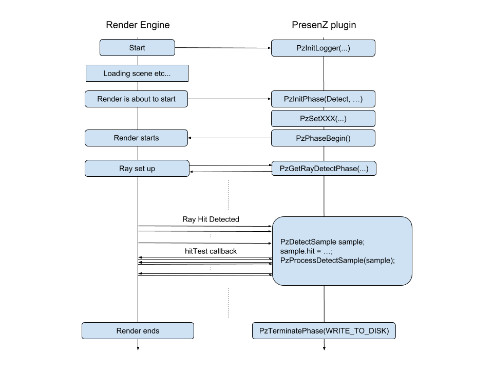
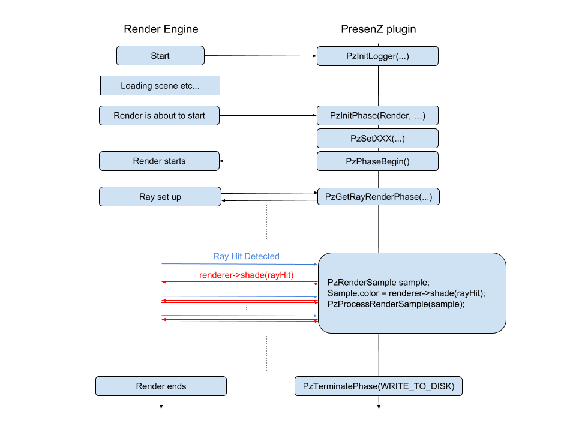

# Detection phase and render phase {#phases}

# 4.1 Detection phase

The Detection Phase will identify which parts of the scene are viewable from within the Zone Of View and will return a przDetect file that is necessary to execute the Render Phase. Below, an overview is given of the several calls your plugin will need to make to let the Render Engine work with PresenZ.

## 4.1.1 Requirements 

As previously mentioned in Section 2, the first phase must issue exactly 256 samples per pixel. PresenZ will require a small implementation (callback) that can check whether there is a line of sight between two points. To be more specific, this callback is used to check if scene geometry is visible from a certain camera .

## 4.1.2 Casting Detection Rays 

When rendering the detection phase we need to go over every pixel in the image and launch a ray for it with PzGetRayDetectPhase(). It is necessary to request the camera origin/direction for each pixel on the target image. This is usually done in the implementation of the camera. To help keep track of the sample index count - an internal counter of PresenZ that tells us how many of the 256 samples we have cast for a pixel- you should also call PzGetCurrentSampleIndexCount() beforehand. An example is presented below:

    const int x = static_cast<int>(pixelX), y = static_cast<int>(pixelY);
    size_t pixelSampleIndex = 0;
    PresenZ::Camera::PzGetCurrentSampleIndexCount(x, y, pixelSampleIndex)
    PresenZ::Camera::PzCameraRay rayCtx =
          PresenZ::Camera::PzGetRayDetectPhase(pixelSampleIndex, pixelX,
               pixelY);

After getting the ray context for a pixel, the data it contains should be forwarded to the ray structure of your current render engine.

    struct PzCameraRay
    {
        inline PzCameraRay() : valid(false) {}
        bool valid;      // True if the ray should be cast, False if the ray can be
                            discarded.
        NozVector origin; // ray origin
        NozVector dir;   // ray direction
        NozVector dDdx;  // ray direction derivatives with respect to x
        NozVector dDdy;  // ray direction derivatives with respect to y
    };

## 4.1.3 Creating a hit test callback function

To check whether a point B is visible from point A, a hit test function needs to be created. This function is render engine dependent and needs to be given to PresenZ as a callback function. We present a mock up of what such a function would look like:

	bool hitTestCallback(const NozVector& origin, const NozVector& dir, const double maxDist, PresenZ::RayTestResult& out, void* userData)
	{
	   RayResult hitData;
	   MyRenderer* renderer = static_cast<MyRenderer*>(userData);
	   if(renderer->Trace(origin, dir, maxDist, &hitData))
	   {
		   out.hit = hitData.location;
		   out.normal = hitData.normal;
		   out.d = hitData.distance;
		   return true;
	   }
	   return false;
	}

The hit test takes five arguments:

- An origin (typically the camera)
- A direction
- The maximum distance a ray is allowed to travel
- A RayTestResult object in which the resulting hit information will be written if it is successful
- A user data pointer that you may use as you wish

In your function, you should call the render-specific “Trace” function and then convert the result into the PresenZ RayTestResult object. The callback returns whether or not something has been hit.
        

### 4.1.3 Passing the hit test callback function to PresenZ

Making PresenZ use your hitTestCallback function is done by passing it to the RayTestInterface. This interface is then used to evaluate each detection sample in PzProcessDetectSample().

	RayTestInterface probe = { myUserDataPtr, hitTestCallback, 0};

	PzDetectSample sample;
	// Set the parameters of the current sample being evaluated.
	// …

	PzProcessDetectSample(&probe, sample, threadIndex);

# 4.2 Render phase

The Render Phase follows the Detection Pass and shades all of the detection samples. Again, we present an overview of what should happen in your plugin for the Render Phase:

## 4.2.1 Requirements

It is important to note that for the Render Phase it is possible that there are more points to shade than the current render resolution allows. 
To resolve this, it should be possible to call multiple renders one after another. That way, we can spread the points over multiple renders, called  “blocks”. 
Additionally, it has to be possible to shade a target from a custom viewpoint. This is especially important when rendering stereoscopic images, 
where we have to “bend rays” to align with the left and right eye view respectively.

## 4.2.2 Casting Render Rays 

Similarly to the Detection Phase, we now need to cast the render rays. A function is provided called PzGetRayRenderPhase() that will return a PzCameraRay given a pixel coordinates on the target image.

    PresenZ::Camera::PzCameraRay rayInfos;
    rayInfos = PresenZ::Camera::PzGetRayRenderPhase(pixelX, pixelY);

As an option, you can call PzGetSamplingPos() to get a random sample location within a pixel. This function needs a seed value, which can either be created through our PzGetSeed() method or through your own render specific seed generator. This seed is a value used for generating the random locations of the samples within a pixel. Ensuring random sampling is important to guarantee a good final result for the pixel. Just as before, you should call PzGetCurrentSampleIndexCount() before casting each ray. Below is presented an example implementation.

	const NozUInt64 seed = PresenZ::Camera::PzGetSeed(pixelX, pixelY);
	size_t pixelSampleIndex = 0;
	if (PresenZ::Camera::PzGetCurrentSampleIndexCount(pixelX, pixelY, pixelSampleIndex)) {
			NozVector2 xy = PresenZ::Camera::PzGetSamplingPos(seed, pixelSampleIndex);
			const double fpixelX = pixelX + xy.x;
			const double fpixelY = pixelY + xy.y;
			rayInfos = PresenZ::Camera::PzGetRayRenderPhase(fpixelX, fpixelY);
	}

## 4.2.3 Shading the Render Rays

After casting the render rays, the samples need to be shaded. Typically shading the samples is done from the camera position, unless you are rendering a stereoscopic image (in that case, you need to bend the rays to the correct eye position before shading, this is explained in section 7). Forward all the ray information to your render engine and execute your shading function:

	//Forward the ray data to your render engine
	engineRay.direction = presenzRay.direction;
	engineRay.dDdx  = presenzRay.dDdx;
	engineRay.dDdy  = presenzRay.dDdy;
	engineRay.hitDistance  = presenzRay.hitDistance;
	engineRay.origin  = presenzRay.origin;
	engineRay.normal = presenzRay.normal;
	//Call your render engine shading function
	shade(engineRay);

## 4.2.4 Forwarding the shaded pixels to PresenZ

Once all the pixels in a bucket have been sampled and shaded, we need to forward those shaded samples to PresenZ. First you will need to loop over each pixel in your bucket and then create an iterator that goes over the samples of that pixel. Below is a pseudo code example on how to process each pixel sample:

    //Create a PzRenderSample object
    PzRenderSample winSample;
    //Set all the sample data
    PzSetSamplePosition(winSample, pos);
    PzSetSampleNormal(winSample, normal);
    PzSetSampleZ(winSample, depth);
    PzSetSamplePosXY(winSample, x, y);
    PzSetSampleColor(winSample, rgba);
    //Add the pixel sample to PresenZ
    PzProcessRenderSample(bucketId, x, y, 0, winSample);

The bucketId parameter is explained in chapter 5.

## 4.2.5 Forwarding AOVs to PresenZ

In the case that you declared AOVs for the sampling, you should also forward these to the PzRenderSample objects. This can be done by looping over the total number of AOVs and adding them to the PzRenderSample. AOVs vector before calling PzProcessRenderSample().

	//aovFormat is a render engine dependent vector containing the AOV data.

	for(int i = 0; i < numAOVs; i++){
		AOVData& aov = winSample.AOVs[i];
		if(aovFormat[i].type == BOOL){
			PresenZ::Ctx::BOOL: aov.b = ...; //get boolean value from aovFormat[i]
		if(aovFormat[i].type == INT){
			PresenZ::Ctx::INT: aov.d = ...;  //get integer value from aovFormat[i]
		//... other AOVs
	}

