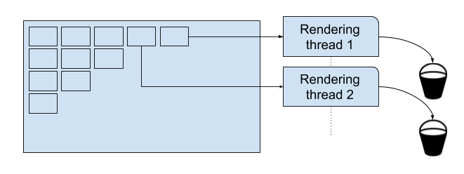

# Buckets and Threading {#threading}

Modern renderers often try to take advantage of the numerous CPU cores available on recent computers. The usual method for that is to cut the image into small patches and assign them to available computing units (thread).

In practice: every little patch is assigned to a thread. Every sample processed in the patch will then be sent into “a bucket”. There is no threading safety around buckets as they are supposed to be accessed by only one thread at a time.

PresenZ is architectured around this concept: PresenZ expects the renderer to communicate when a bucket is initialized and when a bucket is finished. 
Depending on the phase being executed, buckets will be filled with PzDetectSamples or PzRenderSamples. PresenZ does not have special thread safety around its buckets either.

During bucket initialization, PresenZ expect a thread/bucket identifier (between 0 and N) and the target zone that is being rendered. 
After that, buckets can be accessed by the identifier or by the xy position on the final image.        

    void PzInitBucket(bucketId, topX, topY, bottomX, bottomY);

And similarly, when a bucket is finished,

    bool PzProcessBucketFlushToFile(bucketId);

should be invoked.

# 5.1 What if there’s no bucket system in your renderer

It is possible that the renderer does not work with buckets. If this is the case, one solution is to divide the image into small patches and process each patch one by one. Set PzSetThreadNumber() to 1 
and every time that a patch is completed, call PzInitBucket() / PzProcessBucketFlushToFile().

If this solution is not possible either, then the only option remaining is to initialize a bucket with the same dimension as the render target resolution. 
It is recommended that you terminate and re-initialize the bucket at regular intervals so that you don’t end up having the full image in memory.

# 5.2 Serializing buckets for distributed rendering

As the patches are a natural subdivision of the total computational work, it is often the case that the work units are dispatched to other nodes on the network instead of CPU cores.

If this is the case, the final results of buckets need to be copied to and from memory in order to be communicated through the network.

First, you can request how much memory is needed to copy a bucket into a memory buffer.

    int PzProcessBucketGetBufferSize(bucketId);

You can then allocate the correct amount of bytes and copy the bucket content into it with :

    bool PzBucketFlushToMemory(bucketId, bufferSize, buffer);

And your buffer is ready to be sent.

Once the buffer is fully received on another machine, it can be processed with :

    bool PzFlushMemoryBufferToFile(buffer, bufferSize);

