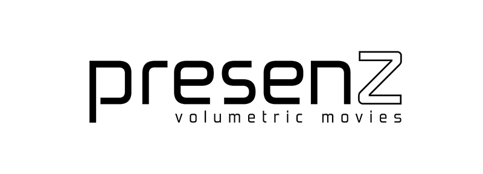

# PresenZ plugin SDK - Programmer Manual

## Table of Contents

- [General flow](@ref flow)
- [Renderer requirements & recommendations](@ref requirements)
- [Initialization/Termination](@ref initTermination)
- [Detection phase and render phase](@ref phases)
- [Buckets and Threading](@ref threading)
- [Transparency](@ref transparencies)
- [Stereoscopic images](@ref stereo)
- [Misc.: Hair and Animation](@ref hair)
- [Implementation example in Vray](@ref vray)
- [Implementation example in Arnold](@ref arnold)
- [Support](@ref support)